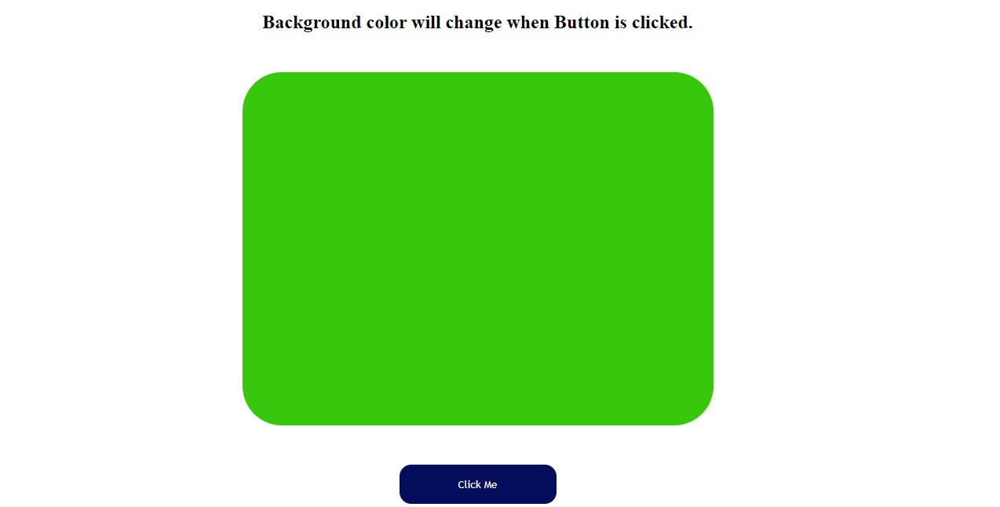

# Project - COLOR CHANGER
 
## 💻 Tech Stack

    - 👉 HTML
    - 👉 CSS
    - 👉 JavaScript

 

## 📌 What I learn?

    - 👉 HTML, CSS and DOM Manipulation
    - 👉 Learned how to handle Click Event Listener
    - 👉 Learned how to change style of HTML element using JavaScript

 

## 📸 Screenshot

 

> Time taken to build this project is 1 Hour and I really enjoyed it.

 

## 🙌 Thanks To:

I am thanks to **Hitesh Choudhary sir**, **Anurag Tiwari sir** and **iNeuron team** for this amazing bootcamp.
